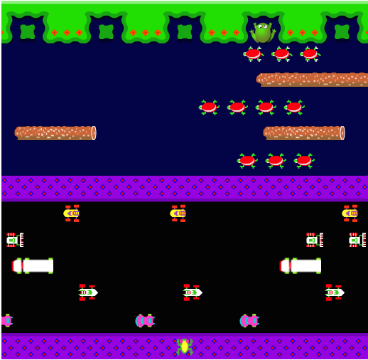

# Frogger

[Play my Frogger Here](www.vicchen.xyz/frogger)

This is my rendition on the classic Frogger arcade game, created with JavaScript
and HTML5 Canvas.

## How to Play

Use the arrow keys to dodge the trucks on the road, then hop onto turtles and
logs until you get to one of five lilypads at the end. Then repeat until you
fill up all five lilypads. Be careful to not hit the sides and to not stay on
the turtles too long (they submerge).

## About

* I used a combination of HTML5 Canvas and JavaScript to create animations, such
as the frog jumping and the turtles submerging.
* All objects inherit from MovingObject to share common functionality
* Frog will move with logs and un-submerged turtles without having to press any arrow keys
* Frogger gameplay

  
